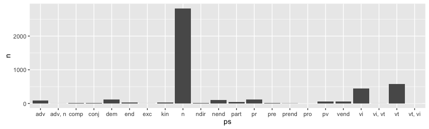

# anamR

An R package of helper functions to read/write/process data from the Kaytetye database (*aname* is Kaytetye for 'helpless'). The lexicon is stored in a backslash-coded .txt file as shown below (first 10 lines):

```
 1 \lx ahe |1
 2     \lx_id 1
 3     \sk ah
 4     \hm 1
 5     \audio ahe
 6     \ta Stirling 450
 7     \sl MT JG
 8     \ps n.
 9     \sn 1
10         \de fight, quarrel, dispute, squabble, trouble
...
...
```

The function `read.KDB()` processes this text file into a table:

| lineno| indent|tag   |content                                    | lx_id|
|------:|------:|:-----|:------------------------------------------|-----:|
|      1|      0|lx    |ahe &#124;1                                |     1|
|      2|      4|lx_id |1                                          |     1|
|      3|      4|sk    |ah                                         |     1|
|      4|      4|hm    |1                                          |     1|
|      5|      4|audio |ahe                                        |     1|
|      6|      4|ta    |Stirling 450                               |     1|
|      7|      4|sl    |MT JG                                      |     1|
|      8|      4|ps    |n.                                         |     1|
|      9|      4|sn    |1                                          |     1|
|     10|      8|de    |fight, quarrel, dispute, squabble, trouble |     1|
|   ... |  ...  | ...  | ...                                       | ...  |

## Example

### Get part of speech (ps tag) for each headword (lx, or lx_id)

```R
library(anamR)
library(tidyr)

ps_df <- read.KDB("path/to/KDB.txt") %>%
            filter(tag == "ps")      %>%
            spread(tag, content)     %>%
            distinct(lx_id,
                     .keep_all = TRUE)
```

First 10 headwords and their parts of speech:

| lineno| indent| lx_id|ps   |
|------:|------:|-----:|:----|
|      8|      4|     1|n   |
|     96|      4|     2|n   |
|    141|      4|     3|n   |
|    221|      4|     4|n   |
|    253|      4|     5|n   |
|    274|      4|     6|n   |
|    310|      4|     7|n   |
|    357|      4|     8|kin |
|    382|      4|     9|kin |
|    446|      4|    10|vi  |
| ...   |   ... | ...  | ... |

### Plot distribution of parts of speech in dictionary

```R
library(ggplot2)

ps_df %>%
  group_by(ps) %>%
  tally()      %>%
  ggplot(aes(x = ps, y = n)) +
  geom_bar(stat = "identity")
```



Looks like there's a whole lot of nouns!
